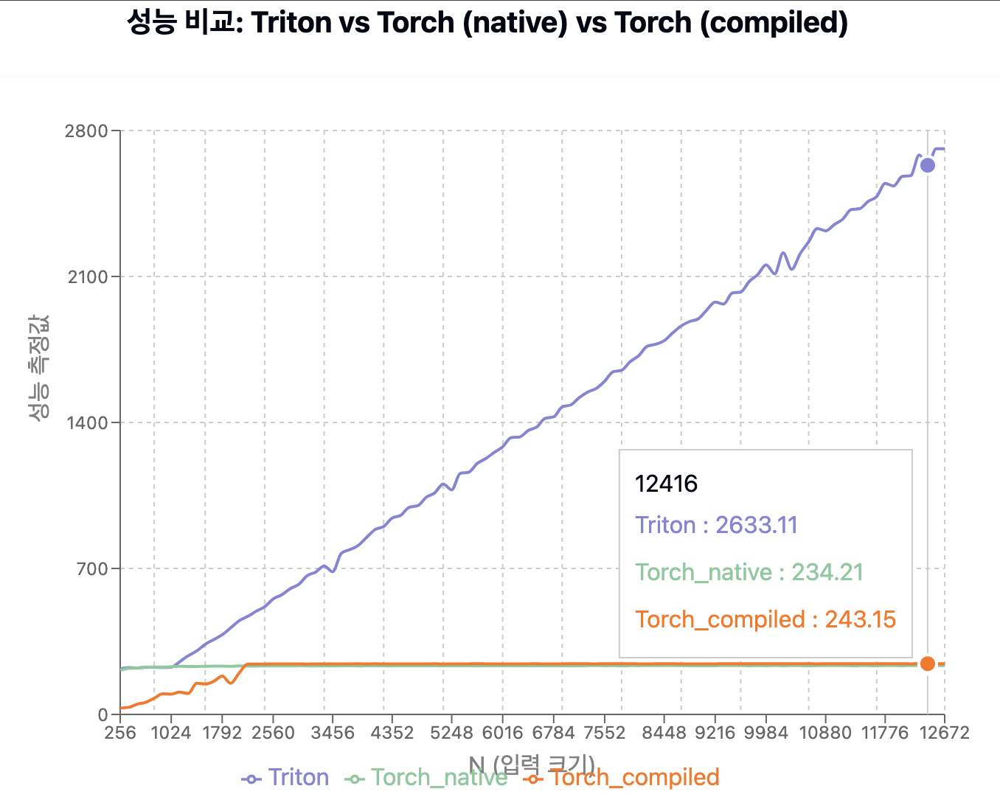

## Goal of Lecture 1

1. Integrate a CUDA kernel inside a pytorch program 
2. Learn how to profile it 

## Simple Profiling w/ timer Event

1. torch.cuda.Event(enable_timing=True).record() 로 이벤트 기록
2. torch.cuda.synchronize() : CUDA 연산은 비동기 함수이기 때문에 정확한 시간 측정을 위해 동기화 수행 
3. start.elapsed_time(end) : start-end 사이의 경과 시간 출력 
- 일반적인 time 함수는 CPU 실행으로 GPU 연산의 수행시간을 알기 위해서는 cuda.Event를 사용해야함
- Torch Profiler Example code : torch_square.py

## Simple Profiling w/ trace profiler

- torch.profiler 모듈을 사용하여 **PyTorch 연산의 성능 분석**
- ProfilerActivity.CPU, ProfilerActivity.CUDA를 사용하여 CPU 및 GPU 프로파일링 수행
- torch.profiler.schedule( wait=1, warmup=1, active=2, repeat=1) 제어
- prof.key_averages().table() 연산을 정리하여 테이블 출력
- Torch Profiler Example code : pt_profiler.py
    
- Trace File, Open in [Chrome Trace](chrome://tracing)
    
    [test_trace_4.json](ref/test_trace_4.json)
    
    
    
    
    
    - ProfileStep#2 : warmup , ProfileStep#3 : active - 실제 프로파일링
    - Call Square fucntion → call aten function

https://colab.research.google.com/drive/1razWowjIJdPXZvxUMUf1arFIjt1G6blX?usp=sharing

## How to run a CUDA kernel from pytorch

- Python 에서 C++ Interface, CUDA kernel Link 코드 예제
- load_inline function 으로 source code / text 연결 가능
- build option 지정
- C++ : CUDA kernel위 CUDA kernel 사이의 인터페이스
- CUDA
    - **global** void square_matrix_kernel: CUDA 커널 정의
        - blockIdx, threadIdx: CUDA 스레드 좌표
            - 행렬의 각 요소를 제곱하는 로직
    - torch::Tensor square_matrix: 파이썬에서 호출할 C++ 함수 구현
        - 스레드/블록 구성 설정
            - CUDA 커널 실행
            - 결과 반환

```python
#JIT 방식을 이용한 build 
square_matrix_extension = load_inline(
    name='square_matrix_extension',
    cpp_sources=cpp_source,
    cuda_sources=cuda_source,
    functions=['square_matrix'],
    with_cuda=True,
    extra_cuda_cflags=["-O2"],
    build_directory='./load_inline_cuda',
    # extra_cuda_cflags=['--expt-relaxed-constexpr']
)
```

- 이외 외부 파일을 이용한 build, link 방식은 Colab 코드 참고

## Integrate a Triton

- Triotion Opt Code ( square_triton.py )

Triton을 이용하여 CUDA GPU, Square 연산 최적화

1. Triton Kernel Code 정의
    - @triton.jit : CUDA Code 컴파일
    - row_idx = tl.program_id(0) : 인스턴스 ID load, 행처리 최적화 GPU에서는 1개의 block이 1개의 행을 담당하며 병령성을 확보
    - row 시작 주소, 인덱스 배열 생성, 메모리 포인터 계산
    - tl.load() : GPU에서 SRAM으로 로드 & Masking
    - Operation
    - Save : 출력 위치 계산, 및 저장
2. Python Interface ( square 함수 ) 정의
    - 함수 정의
    - BLOCK_SIZE = triton.next_power_of_2(n_cols): 입력 크기에 맞는 최적화된 연산 단위 계산
    - num_warps : 32개의 스레드로 구성된 GPU 실행 단위
        - 워프수를 늘리면 많은 스레드가 한개의 행을 처리
        - 큰 사이즈 행렬일수록 많은 병렬처리가 필요
    - 커널 실행 및 결과 반환
3. 검증 테스트
    - UT
    - benchmark test
- Perfermence View
    1. Dynamic Block Size  
        
        
        
        [square-performance-chart.tsx](ref/performance-comparison-chart.tsx)
        
    2. Optimization, fix block_size as 1024
        
        
        
        [performance-comparison-chart.tsx](ref/performance-comparison-chart.tsx)
        

BLOCK_SIZE = 1024로 고정 시, triton 성능이 월등히 향상된 이유  

- 메모리 접근 패턴이 GPU의 L1/L2 캐시에 맞게 최적화됨
- 쓰레드 활용도가 증가하고, warp 단위 실행이 원활해짐
- 전역 메모리 접근이 coalesced 되어 DRAM 대역폭 활용도가 극대화됨
- num_warps 조정과 함께 작동하여 전체적인 실행 효율이 향상됨

triton.jit(interpret=True)로 Breakpoint 설정이 가능 : breakpoint()

## Look at PTX

PTX : Parallel Thread eXecution. CUDA Kernel Assembly Code 

CUDA Thread Block : 실행되는 스레드 그룹 

- Thread → Block → Grid
- 같은 Block내의 Thread는 공유 메모리 사용 & 동기화
- Block 은 병렬화의 기본 단위

square_kernel.py → ptx 로 변환 

- PTX 세부 분석
    
    [square_kernel.ptx](square_kernel.ptx)
    
    Kernel 진입점 정의 
    
    ```nasm
    .visible .entry square_kernel_0d1d234( // 외부에서 호출 가능한 커널 함수 정의
        .param .u64 square_kernel_0d1d234_param_0, // 64bit pointer
        .param .u64 square_kernel_0d1d234_param_1, 
        .param .u32 square_kernel_0d1d234_param_2, // 32bit pointer 
        .param .u32 square_kernel_0d1d234_param_3,
        .param .u32 square_kernel_0d1d234_param_4
    )
    .maxntid 128, 1, 1 // Block maximum Threads numbers, 1D Block 
    ```
    
    Register 선언 
    
    ```nasm
    {
        .reg .pred %p<25>; // 25개의 조건부 레지스터 
        .reg .b32 %r<40>;  // 40개의 32bit Int Register 
        .reg .f32 %f<17>;  // 17개의 32bit Float Register 
        .reg .b64 %rd<24>; // 24개의 64bit Regitser ( Memory Pointer )   
    ```
    
    - `%tid.x`: 현재 스레드의 x 인덱스
    - `%ctaid.x`: 현재 스레드 블록의 x 인덱스
    
    매개변수 로드  
    
    ```nasm
    // 64bit pointer로 param load 
    ld.param.u64 %rd17, [square_kernel_0d1d234_param_0]; 
    ```
    
    - `ld.{dataType}`: {dataType} 로드
    - `st.{dataType}`: {dataType} 저장
    
    Thread Index, Block Index, Memory Offset 계산 
    
    ```nasm
    mov.u32 %r25, %tid.x; // 현재 Thread x index 
    and.b32 %r26, %r25, 127; // x index & 127 > 8bit masking 
    
    mul.lo.s32 %r38, %r37, %r27; // block index * Data Size 
    mul.wide.s32 %rd19, %r38, 4; // Byte 단위 변환 
    add.s64 %rd20, %rd18, %rd19; // 데이터 주소 계산 
    ```
    
    `mul.lo`, `mul.wide`: 곱셈 연산(lo는 하위 비트만, wide는 결과 크기 확장)
    
    Data load 
    
    `setp.lt`: 비교 연산 후 조건 레지스터 설정
    
    ```nasm
    setp.lt.s32 	%p1, %r26, %r31; // 2개의 Register간의 조건 비교 
    // 조건부로 Global memory load 
    @%p1 ld.global.b32 { %r1 }, [ %rd1 + 0 ]; // True : Data Load 
    @!%p1 mov.u32 %r1, %r2; // Flase : default value 
    mov.b32 %f1, %r1; 
    ```
    
    - `@%p1`: 조건부 실행(%p1 조건이 참일 때만 명령 실행)
    - `@!%p1`: 반대 조건부 실행(%p1 조건이 거짓일 때만 명령 실행)
    
    제곱 연산 
    
    ```nasm
    mul.f32 %f9, %f1, %f1;
    mul.f32 %f10, %f2, %f2;
    ...
    ```
    
    결과 저장 
    
    ```nasm
    mov.b32 %r17, %f9; // 부동 소수점을 32Bit 변환 
    @%p1 st.global.b32 [ %rd9 + 0 ], { %r17 }; //Global 메모리에 저장 
    ```
    
     Register 선언  
    

## NCU Profiler

[NCU_Profile/triton-square-profile.py](NCU_Profile/triton-square-profile.py)

NVIDIA Nsignt Compute : CUDA Kernel 성능 분석, Bottleneck 최적화 

- 메모리 사용량, 연산 효율, Treads 병렬성 분석
- Code 실행 구간 동안, 전체 인스턴스에 대한 연산 수행시간 분석

Profile Summary

| **Column** | **설명** |
| --- | --- |
| **Estimated Speedup [%]** | 성능 최적화를 적용했을 때 예상되는 속도 향상 비율 |
| **Function Name** | 분석 대상 CUDA 커널의 함수 이름 (예: square_kernel) |
| **Demangled Name** | C++의 맹글링된 (Mangled) 이름을 해제한 함수명 |
| **Duration [us]** | 해당 커널 실행 인스턴스의 실행 시간 (마이크로초 단위) |
| **Runtime Improvement [us]** | 최적화 적용 시 예상되는 실행 시간 단축량 |
| **Compute Throughput [%]** | GPU Streaming Multiprocessor(SM)의 활용률 |
| **Memory Throughput [%]** | 메모리 대역폭 활용률 |
| **# Registers [register/thread]** | 스레드당 사용하는 레지스터 개수 |
| **Grid Size** | CUDA 커널 실행 시 사용된 Grid 크기 (총 블록 개수) |
| **Block Size [block]** | CUDA 블록 크기 (한 블록당 스레드 개수) |

[NCU_Profile/table.csv](NCU_Profile/ncu_profile_summary_table.csv)
Profile Table 분석 

- Grid Size가 Test 별로 [ 1, 8, 64, 512, 512 ] 로 증가
- Grid Size에 따라 Memory TP 효율성이 증가
- 단순 Square 연산의 반복이므로 Compute TP는 높지 않음

→ 연산이 매우 단순하여 GPU 연산 장치를 활용하지 않음 

→ Grid Size가 작을 경우, 적은 Threads를 활용하며 Memory 비효율성이 높음 

→ Memory Load에서 Bottleneck이 존재하며, Block Size가 클 수록 완화 됨 