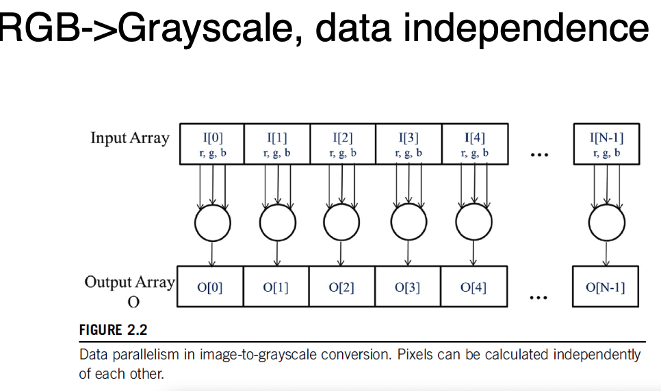
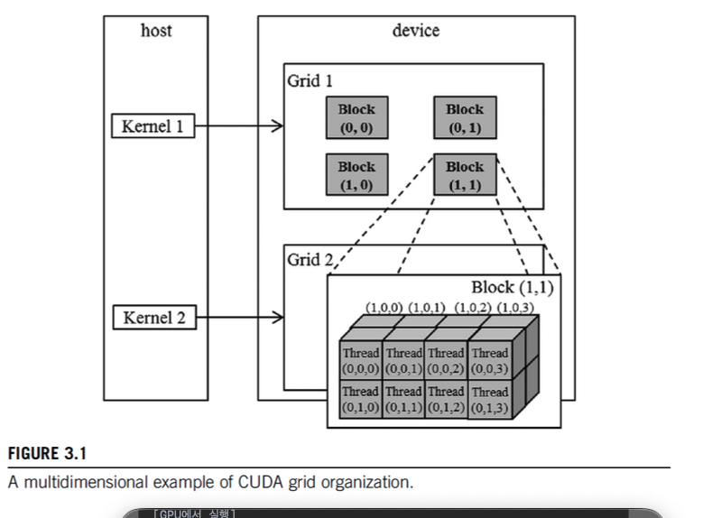
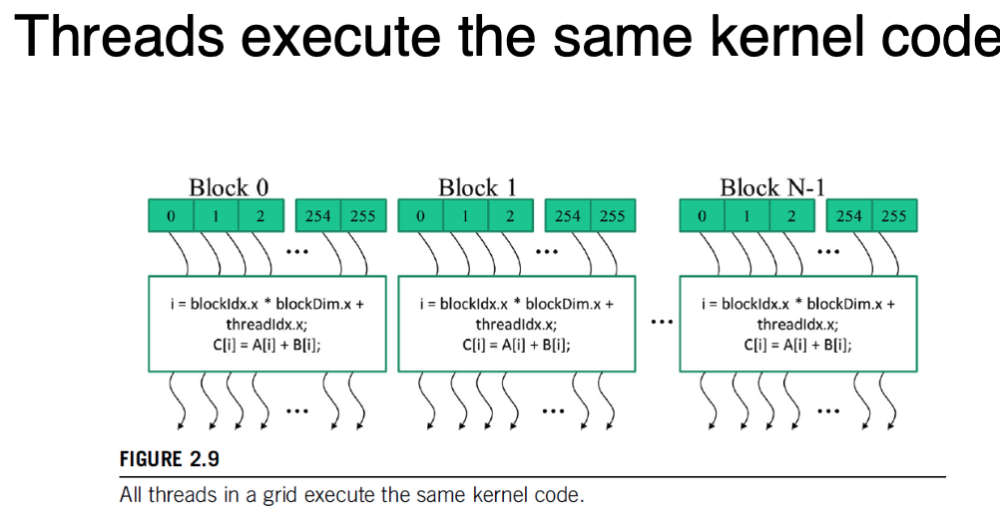

## Lecture 2 examples
Please make sure PyTorch (2.1.2) and cuda-toolkit (nvcc compiler) are installed.
  - `vector_addition`: Classic CUDA C example, to compile use `make` in the `vector_addition` directory.
  - `rgb_to_grayscale`: Example uses PyTorch's `torch.utils.cpp_extension.load_inline` feature to compile a custom RGB to grayscale kernel and uses it to convert input image to grayscale and which is saved in as `output.png`. Run in the `rgb_to_grayscale` folder `python rgb_to_grayscale.py`.
  - `mean_filter`: This example also uses the PyTorch's `cpp_extension.load_inline` feature to compile a mean filter kernel. The kernel read pixel values in the surrounding (square area) of a pixel and computes the average value for each RGB channel individualy. The result is saved to `output.png`. Run in the `mean_filter` folder `python mean_filter.py`.


PMPP(Programming Massively Parallel Processors) 
Book Chapter 1-3  

### Agenda

1. Inroduction 
2. Heterogeneous data parallel computing 
3. Multidimensional grids and data 

## Introduction

GPU 연산이 매무 많아지고, 연산량은 크게 증가하고 있다. 

Classic Software : Sequential Program based on CPU 

→ Multi-core CPU came up : Need to learn multi-threading ( Deadlocks, races condition ) 

### **The Power Wall**



- Transistors : Operation Units on Chip ( 집적도 ) 
트렌지스터가 더 많을 수록 → 더 많은 연산, 복잡한 회로, 기능 수행 가능
- Frequency : Clock ( 1초당 연산 가능 횟수 ) 
CPU/GPU가 명령을 얼마나 빠르게 실행 할 수 있는가

Power Wall  : Frequency를 증가 시킬 경우 전력 소비, 발열이 기하 급수정으로 증가하여 올릴 수 없음. 

→ Frequency의 증가는 멈추기 시작하였고, Trangister를 늘리는 방향 ( Multi-core, GPU )으로 발전 

### The rise of CUDA

CUDA is all about parallel programs ( modern SW ) 

Main Principle

- Parallel Programming 중심 : 대량 병렬 프로그램을 위한 플렛폼
- FLOPS에 최적화 ( 딥러닝, 시뮬레이션 )
- Divide work among threads → 많은 core를 효율적으로 활용하기 위해 Threads 숫자 증가
- GPUs focus on execution TP of massive number of threads
    - CPU는 low latency에 최적화, GPU는 TP(많은 양 처리)에 최적화
- CPU + GPU
    - CPU : Sequential Part, Branch & Flow Control
    - GPU : numerical intensive parts ( 수치 계산, 행렬 연산 병렬처리 )

이전에는 GPGPU 그레픽 API(OpenGL, Direct3D)를 이용하여 GPU 연산에 활용. 

현재는 CUDA를 이용하여 GPU Programming 효율화 

## Amdahl’s Law

프로그램에서 병렬화 . 할수 없는 부분이 존재하는 한, 전체 성능 향상에는 한계가 있다. 

$\because$  순차적으로 처리하는 부분이 병목을 야기하기 때문 

( Achievable speedup is limited by the parallelizable portion ***p*** of programs )

${Speedup} < \frac{1}{1 - p}$ { speedup = slow_sys_time / fast_sys_time , p : parallelizable portion }

딥러닝 연산에서는 p가 99% 이상이기 때문에, GPU로 성능 최적화가 가능함 

### Challenges

Designing parallel Algorithms is very Hard

- 데이터 의존성, 동기화, 분기 처리 등을 신경써야함.
- Recurrent computation 병렬화에 직관적이지 않음 ( 피보나치, 누적합 )
    - Prefix sum은 전체 Data를 Scan해야 하므로, 병렬화가 어려움
- Memory latency / Throughput bottlenecks
    - 병렬 연산보다 메모리 접근 속도가 느려서 명목이 되는 경우가 많음 ( memory bound )
- Performance varies with input characteristics
    - Data align, arrage, ordering에 영향을 받음 → Load balancing에 영향을 받음
- Not all problems are “embarrassingly parallel”
    - embarrassingly parallel : Thread 사이에 데이터 전달이 필요 없는 문제 ( Image filter, Mul Array )
    - inherently sequential : Thread 사이에 데이터 공유가 필요 → Overhead 발생

## Main Goals of the Book

1. Parallel programming & computational thinking
2. Correct & reliable: debugging function & performance
3. Scalability: regularize and localize memory access  (How to organize Memory ) 

## Heterogeneous( CPU + GPU )  data parallel computing

CUDA는 CPU와 GPU를 연동하여 연산 처리를 진행 

- CPU : Sequential Part, Branch & Flow Control
- GPU : numerical intensive parts ( 수치 계산, 행렬 연산 병렬처리 )

Data parallelism ← Break work down into computation ( 독립 수행이 가능한 연산들로 파편화 ) 

- ex. vector addition & kernel to convert an RAG image to grayscale , weight sum
    
    
    

### CUDA

ANSI C + CUDA Keword ( **global**, **device**, **host**, **shared**, __syncthreads() )

- CPU (host) , GPU (Device) 서로 분리된 공간을 보고, 데이터를 cudaMemcpy로 공유

Kernel = Device code Function , GPU에서 실행되는 함수 { ex.  **global** void myKernel(…) }

CPU & GPU code runs concurrently ( overlapped )  → 효율성 확보 

GPU에서는 수천~수만개의 Threads를 사용 , Threads가 많을수록 효율성 확보 

Keep data on the gpu as long as possible ( $\because$ Need Asynchronously schedule )

Memory Allocation 

- nvidia devices come with their own DRAM (device) global memory
- cudalMalloc & cudaFree로 Memoery 할당 ( on global memory )

| **메모리 타입** | **위치** | **접근 주체** | **특징** |
| --- | --- | --- | --- |
| **Global Memory** | GPU DRAM | GPU의 모든 thread | 크기 큼, 느림, **공용** |
| **Shared Memory** | GPU SM 내부 | Block 내의 thread만 | 빠름, 작음, **Block 한정 공유** |
| **Local Memory** | GPU 내부 (레지스터 or 글로벌 DRAM) | 특정 thread 전용 | 실제론 글로벌에 저장됨 |
| **Host Memory** | CPU RAM | CPU만 직접 접근 가능 | GPU에서 접근하려면 복사 필요 (cudaMemcpy) |

Memory Tranfer 

- cuddaMemcpy : Copy data from CPU memory ↔ GPU memory
    - option : cudaMemcpyHostToDevice, cudaMemcpyDeviceToHost

Error handling : Return ‘ cudaError_t’  else ‘cudaSuccess’ 

GPU에서의 Core & Threads 용어 정리 

- Core ⊂ Thread ⊂ Warp ( 32 * Thread)  ⊂ SM ⊂ GPU 
Threads  ⊂ Grids⊂ Block 으로 Thread를 어떻게 관리할지에 대한 SW적인 단위
    
    
    | **용어** | **설명** | **비유** |
    | --- | --- | --- |
    | **CUDA Core** | GPU에서 연산을 실제로 수행하는 작은 계산 유닛 (HW)  | CPU의 Core와 유사 |
    | **Thread** | - 하나의 연산 작업 단위 (벡터 계산, 픽셀 처리 등) (SW) 
    - 실제 연산 단위  | 계산 명령 하나 |
    | **Warp** | - 32개의 Thread 묶음 (SIMD로 함께 실행됨)
    - 스케줄링 단위  | 소대 |
    | **SM (Streaming Multiprocessor)** | 여러 CUDA Core를 포함하는 연산 그룹 | 중대 |
    | **GPU** | 여러 SM의 집합체 | 사단  |
    
    ```bash
    GPU
    ├── SM 0
    │   ├── Block 0
    │   ├── Block 1
    ├── SM 1
    │   ├── Block 2
    │   ├── Block 3
    ├── SM 2
    │   ├── Block 4
    │   └── Block 5
    ...
    
    Global Thread ID: 0 | Block: 0 | Thread: 0 | Warp: 0
    Global Thread ID: 1 | Block: 0 | Thread: 1 | Warp: 0
    ...
    Global Thread ID: 31 | Block: 0 | Thread: 31 | Warp: 0
    Global Thread ID: 32 | Block: 0 | Thread: 32 | Warp: 1
    ...
    Global Thread ID: 255 | Block: 3 | Thread: 63 | Warp: 1
    ```
    
     + 에서의 Core & Threads 용어 정리 
    
    | **용어** | **설명** | **다른 이름** |
    | --- | --- | --- |
    | **Physical Core** | 실제 존재하는 하드웨어 코어 | 진짜 코어 |
    | **Thread** | 실행 가능한 작업 단위 (Core가 처리함) | 작업 흐름 |
    | **Virtual Core** | 하이퍼스레딩으로 인해 운영체제에 보이는 “논리적 코어 수” | **vCore = Thread** |

### Kernel function fn <<>> ( 커널 실행 고유 문법 )

Launching kernel = grid of thread is launched 

myKernel<<<numBlocks, threadsPerBlock>>>(args...); 
→ GPU에서 수천개 ( numBlocks * threadsPerBlock ) Thread가 동시 실행 → Grid of Threads 

All threads execute the same code : Single program multiple-data ( SPMD )



- 모든 Thread가 같은 코드를 실행, 각자 데이터를 처리

Threads are hierarchically organized into grid blocks & thread blcoks (upto 1024 Thr. in block) 

### Kernel Coordinates

built-in variables : blockIdx, threadIdx 

→ coordinates allow thread to identify what to do ( which portion of the data to process )
each thread can be uniquely identifed vy threadIdx & blockIdx 

### __global__ & __host__

Declare a kernel function with __global__ 

- Calling → launched new grid of cuda threads
    - declared with __divice__ can be called from within a cuda thread

### Calling Kernels

kernel configuration is specified between ‘<<<’ and ‘>>>’ ( number of blocks, threads in each block ) 

### Compiler

nvcc(NVIDIA C Compiler) is used to compile kernes into PTX → SASS 

PTX ( Parallel Thread Execution )

- low-level VM (PTX를 해석하고 SASS로 바꾸기 위한 플렛폼)
- instruction set , IR, GPU용 assembly(SASS) 이전단계

SASS ( Streaming Assembler ) 

- PTX가 실제 GPU Assembly 로 번역된 코드
- GPU 아키텍처에 최적화된 바이너리 코드
- GPU에서는 실제로 이 SASS를 실행 ( GPU 종류마다 다름 )

## Multidimensional grids and data

CUDA grid : 2 level hierarchy : Block , Threads 

- map threads to multi-dimensional data
- all threads in a grid execute the same kernel
- threads in same block can access the same shared memory
- max block size : 1024 threads
    - shape of grid & blocks:
        - **gridDim**: number of blocks in the grid
        - **blockDim**: number of threads in a block
    
    
    

### Grid continued

Grid can be different for each kernel launch. ( dependent on data shape ) 

Simple Strategy : one thread per output element

Threads can be scheduled in any order ( Thread 간 실행 순서는 보장되지 않음 ) 
→ 의존성이 있는 연산은 __synchthreads () 또는 atomic 연산 등으로 다뤄야함

can use fewer than 3 dims ( no use : 1 ) 

### nd-Arrays in Memory

memory of multi-dim arrayas under the hood is flat 1d 

2d array can be linearized different way ( row-major, column-major ) 

### Useful examples

- Each thread writes one output element ( reads multiple values )
- single plane can be extended easily to multi-channel

### mean_filter

입력 픽셀에 대한 주변 픽셀들의 평균값을 계산 → Bler 효과 적용 

각 Thread는 이미지의 한 픽셀을 담당 

```cpp
// 각 Thread에서 수행한 kernel 연산 정의 
__global__
void mean_filter_kernel(unsigned char* output, unsigned char* input, int width, int height, int radius) {
		// Thread Pixel별로 할당되기 때문에, Thread의 차원 값으로 (row,col) 정의 
		int col = blockIdx.x * blockDim.x + threadIdx.x;
		int row = blockIdx.y * blockDim.y + threadIdx.y;
    // ...
}
```

Bound condition Check 

```cpp
// Bound를 벗어나는 pixel은 무시 
for (int blurRow=-radius; blurRow <= radius; blurRow += 1) {
    for (int blurCol=-radius; blurCol <= radius; blurCol += 1) {
        // ...
    }
}

```

효율적인 연산 단위 구성 및 thread 배열 

```cpp
    dim3 threads_per_block(16, 16, channels);
    dim3 number_of_blocks(
        cdiv(width, threads_per_block.x),
        cdiv(height, threads_per_block.y)
    );
```

### rgb_to_grayscale

RGB 이미지를 그레이스케일로 변환

연산 결과는 tensor() 로 CPU로 Transfer 하지 않고, 바로 이미지로 저장 

### vector_addition

> Colab 환경에 맞게 make file 수정
> 

두 벡터의 덧셈을 GPU에서 병렬 처리하는 프로그램

CUDA Error Handling 

```c
#define gpuErrchk(ans) { gpuAssert((ans), __FILE__, __LINE__); }
inline void gpuAssert(cudaError_t code, const char *file, int line, bool abort = true) {
  if (code != cudaSuccess) {
    fprintf(stderr, "GPUassert: %s %s %d\n", cudaGetErrorString(code), file, line);
    if (abort) {
      exit(code);
    }
  }
}

```

vecAdd Operation 

```c
void vecAdd(float *A, float *B, float *C, int n) {
  cudaMalloc((void **)&A_d, size);
  //..
  cudaMemcpy(A_d, A, size, cudaMemcpyHostToDevice);
  //..
  vecAddKernel<<<numBlocks, numThreads>>>(A_d, B_d, C_d, n);
	gpuErrchk(cudaPeekAtLastError());
  gpuErrchk(cudaDeviceSynchronize());

  cudaMemcpy(C, C_d, size, cudaMemcpyDeviceToHost);

  cudaFree(A_d);
}

```

- `cudaMalloc`으로 GPU 메모리를 할당합니다.
- `cudaMemcpy`로 CPU에서 GPU로 입력 데이터를 복사합니다.
- 커널을 실행하여 GPU에서 계산을 수행합니다.
- `cudaPeekAtLastError()`는 커널 실행 시 발생한 오류를 체크합니다.
- `cudaDeviceSynchronize()`는 모든 GPU 작업이 완료될 때까지 기다립니다.
- 결과를 GPU에서 CPU로 복사합니다.
- GPU 메모리를 해제합니다.